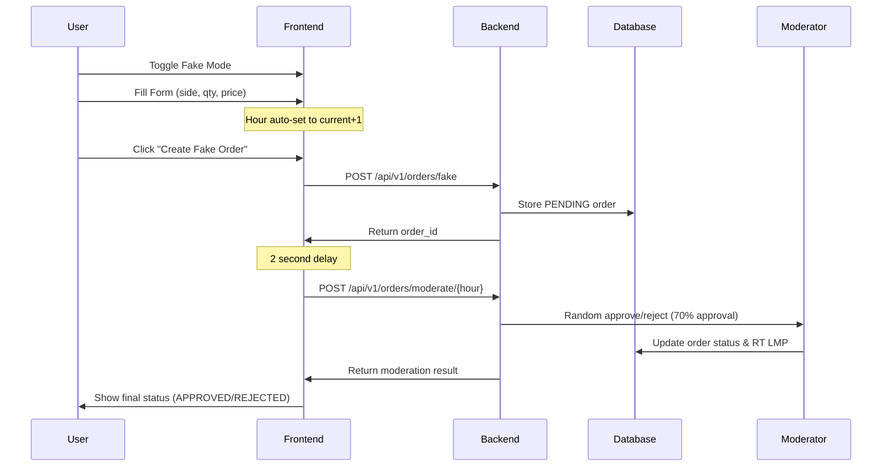

# 🤖 Auto-Moderation Fake Mode

The fake mode has been enhanced with automatic hour selection and random moderation system.

## 🎯 **New Fake Mode Behavior**

### **Hour Selection - DISABLED**
- ❌ **No manual hour selection** in fake mode
- ✅ **Auto-selected**: Current time + 1 hour
- 🕐 **Example**: If current time is 14:30, fake order is for 15:00-16:00

### **Auto-Moderation Process**
1. **Order Created**: Fake order stored in database with PENDING status
2. **2-Second Delay**: Brief pause for visual feedback
3. **Auto-Moderate**: System automatically approves/rejects with random logic
4. **Real-Time Update**: UI updates with final status and price

## 🎲 **Random Moderation Logic**

### **Approval Probability: 70%**
- 70% chance of APPROVED status
- 30% chance of REJECTED status

### **Random RT LMP Generation (if approved):**
- **Base Price**: $40.00/MWh
- **Variance**: ±$10.00/MWh
- **Range**: $30.00 - $50.00/MWh
- **Example**: Approved at $42.35/MWh

### **Random Rejection Reasons (if rejected):**
- "Insufficient market liquidity"
- "Price outside acceptable range" 
- "Grid constraints"
- "Random rejection for testing"

## 🔄 **API Flow**



## 🎨 **UI Changes**

### **Hour Selection Box (Fake Mode)**
```
┌─────────────────────────────────────────────┐
│ 📁 Auto-selected: 15:00 - 16:00            │
│    Fake mode uses current time + 1 hour    │
│                               ~$42.50       │
└─────────────────────────────────────────────┘
```

### **Status Messages**
1. **Creation**: "Fake order created for hour 15:00! Order ID: 3ec7bc61..."
2. **Approved**: "Order approved at $42.35 - moderate_hour:random"
3. **Rejected**: "Order rejected - Insufficient market liquidity"

## ⚙️ **Backend Components**

### **`moderate_hour.py`**
- Random approval/rejection logic
- RT LMP price generation
- Database status updates
- Batch processing for hours

### **API Endpoints**
```bash
# Create fake order (auto uses current+1 hour)
POST /api/v1/orders/fake

# Auto-moderate specific hour
POST /api/v1/orders/moderate/2025-08-17T15:00:00Z
```

## 🚀 **User Experience**

### **Streamlined Workflow**
1. **Toggle fake mode** → Orange theme activated
2. **Enter trade details** → Side, quantity, limit price
3. **Click "Create Fake Order"** → No hour selection needed
4. **Auto-moderation** → 2 seconds later, see final result
5. **View in positions** → Order appears in positions table

### **Benefits**
- ✅ **No time slot confusion** - always current+1 hour
- ✅ **Instant results** - 2-second auto-moderation
- ✅ **Real database storage** - same as manual seed script
- ✅ **Realistic prices** - random RT LMP generation
- ✅ **Testing friendly** - 70% approval rate for variety

## 🧪 **Perfect for Testing**

The new fake mode is ideal for:
- **Quick order creation** without hour selection complexity
- **Realistic approval/rejection** simulation
- **Database testing** with real order lifecycle
- **P&L calculation** validation with random RT prices

No more manual `seed_fake_order.py` scripts - everything is automated through the UI! 🎉