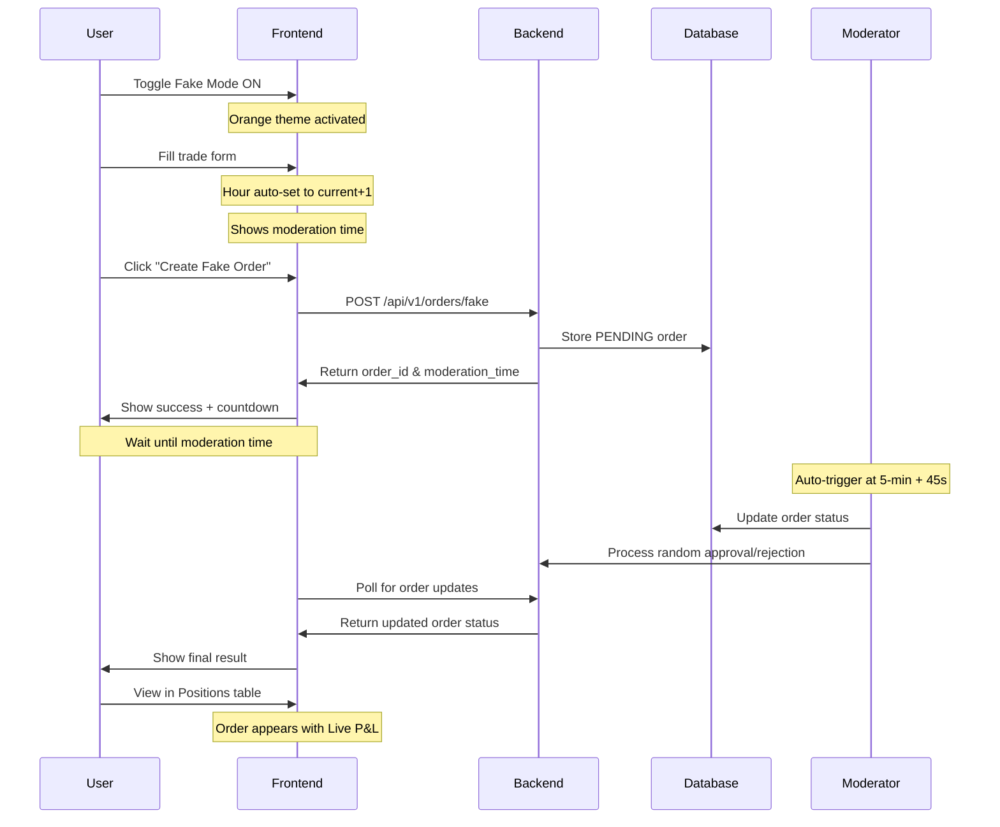

# 🎮 Fake Mode Complete Guide

The Fake Mode provides a comprehensive testing and development environment that simulates realistic energy trading without market constraints. This guide covers all aspects of fake mode functionality, timing, and implementation.

---

## 🎯 Overview

Fake Mode allows you to:
- ✅ **Place orders anytime** - No 11:00 AM ET market cutoff restrictions
- ✅ **Auto-moderation** - Orders automatically approved/rejected with realistic timing
- ✅ **Real database storage** - Orders stored in SQLite with full lifecycle tracking
- ✅ **Realistic market simulation** - 5-minute interval processing with buffers
- ✅ **Random outcomes** - 70% approval rate with realistic price generation

---

## 🔧 Implementation Details

### Database Integration

Fake orders use the **same database schema** as live orders:

```sql
CREATE TABLE orders (
  id TEXT PRIMARY KEY,                    -- UUID (e.g., "3ec7bc61-d604...")
  created_at TEXT NOT NULL,              -- ISO8601 UTC timestamp
  market TEXT NOT NULL,                  -- Always 'DA' (Day-Ahead)
  location_type TEXT NOT NULL,           -- Always 'ZONE'
  location TEXT NOT NULL,                -- e.g., 'PJM-RTO'
  hour_start_utc TEXT NOT NULL,          -- ISO8601 UTC (auto: current+1 hour)
  side TEXT NOT NULL,                    -- 'BUY' or 'SELL'
  qty_mwh REAL NOT NULL,                 -- Quantity in MWh
  limit_price REAL NOT NULL,             -- Limit price in $/MWh
  status TEXT NOT NULL,                  -- 'PENDING' → 'APPROVED'/'REJECTED'
  
  -- Approval tracking
  approved_at TEXT,                      -- Timestamp when moderated
  approval_rt_interval_start_utc TEXT,   -- RT interval reference
  approval_rt_lmp REAL,                  -- RT LMP at approval ($30-$50)
  approval_rt_source TEXT,               -- 'moderate_hour:random'
  reject_reason TEXT                     -- Reason if rejected
);
```

### Backend Components

**`fake_order_manager.py`** - Database operations:
- Database initialization and schema management
- Order creation with UUID generation
- Status updates and approval tracking

**`moderate_hour.py`** - Auto-moderation system:
- Random approval/rejection logic (70% approval rate)
- RT LMP price generation ($30-$50 range)
- Batch processing for specific hours

---

## ⏰ Realistic Timing System

### Smart Hour Selection

**Auto-Selected Hour Logic:**
- **Current Time**: 3:27 PM → **Order Hour**: 4:00 PM - 5:00 PM
- Always selects **current time + 1 hour** for realistic market behavior
- No manual hour selection needed in fake mode

### 5-Minute Moderation Intervals

**Realistic Market Timing:**
```
Current Time: 3:27 PM
Next 5-min:  3:30 PM
Moderation:  3:30:45 PM (45-second buffer)
Status:      PENDING until moderation triggers
```

**Interval Calculation:**
```typescript
const getNextModerationTime = () => {
  const now = new Date(currentTime)
  const minutes = now.getMinutes()
  const nextFiveMin = Math.ceil(minutes / 5) * 5
  
  const moderationTime = new Date(now)
  if (nextFiveMin >= 60) {
    // Next hour, 0 minutes + 45 seconds
    moderationTime.setHours(moderationTime.getHours() + 1, 0, 45, 0)
  } else {
    // Same hour, next 5-min mark + 45 seconds  
    moderationTime.setMinutes(nextFiveMin, 45, 0)
  }
  
  return moderationTime
}
```

**Example Timeline:**
- **3:27 PM** - Order placed (PENDING)
- **3:30:45 PM** - Auto-moderation triggered
- **3:30:46 PM** - Result displayed (APPROVED/REJECTED)

---

## 🎲 Random Moderation Logic

### Approval Probability: **70%**

**Approval Outcomes:**
- **70% chance**: Order approved with random RT LMP
- **30% chance**: Order rejected with realistic reason

### RT LMP Generation (If Approved)

**Price Parameters:**
- **Base Price**: $40.00/MWh
- **Variance**: ±$10.00/MWh  
- **Final Range**: $30.00 - $50.00/MWh
- **Precision**: Rounded to 2 decimals (e.g., $42.35)

```python
rt_lmp = rt_lmp_base + random.uniform(-rt_lmp_variance, rt_lmp_variance)
rt_lmp = max(0.01, round(rt_lmp, 2))  # Ensure positive price
```

### Rejection Reasons (If Rejected)

Random selection from realistic market conditions:
- "Insufficient market liquidity"
- "Price outside acceptable range"
- "Grid constraints" 
- "Random rejection for testing"

---

## 🎨 User Interface Experience

### Fake Mode Toggle

**Visual Indicators:**
- 🟠 **Orange theme** when fake mode is active
- 📁 **"Fake Mode Active"** banner with timing info
- 🕒 **Moderation countdown** showing next processing time

```
┌─────────────────────────────────────────────────────────┐
│ 📁 Fake Mode Active                                     │
│    Orders auto-moderate at 3:30:45 PM (next 5-min + 45s) │
└─────────────────────────────────────────────────────────┘
```

### Hour Selection (Auto-Set)

**No Manual Selection Needed:**
```
┌─────────────────────────────────────────────────────────┐
│ Auto-selected: 16:00 - 17:00          ~$42.50          │
│ Fake mode uses current time + 1 hour                   │
│ ─────────────────────────────────────────────────────── │
│ 🕒 Moderation at: 3:30:45 PM (next 5-min + 45s buffer) │
└─────────────────────────────────────────────────────────┘
```

### Form Behavior

**Fake Mode Active:**
- ✅ **Button Text**: "Create Fake Order"
- ✅ **No Time Restrictions**: Can place orders 24/7
- ✅ **Immediate Storage**: Order stored in database immediately
- ✅ **Auto-Selected Hour**: Always current time + 1 hour

**Live Mode (Original):**
- ✅ **Button Text**: "Submit DA Bid" 
- ✅ **Time Restrictions**: Respects 11:00 AM ET cutoff
- ✅ **In-Memory Only**: Simulation without database storage

### Status Messages

**Order Creation:**
```
✅ Fake order created for hour 16:00! 
   Order ID: 3ec7bc61... (Pending until 3:30:45 PM)
```

**Approval Result:**
```
✅ Order approved at $42.35 - moderate_hour:random
   Live P&L calculation now active
```

**Rejection Result:**
```
❌ Order rejected - Insufficient market liquidity
   Order moved to closed positions
```

---

## 📡 API Endpoints

### Create Fake Order

```bash
POST /api/v1/orders/fake
```

**Request Parameters:**
```json
{
  "side": "BUY",           // "BUY" or "SELL"
  "qty_mwh": 5.0,         // Quantity in MWh
  "limit_price": 45.00,    // Limit price $/MWh
  "hour_start_utc": "2025-08-17T16:00:00Z",  // Auto-calculated
  "location": "PJM-RTO",   // Grid location
  "location_type": "ZONE"  // Location type
}
```

**Response:**
```json
{
  "status": "success",
  "message": "Fake order created successfully",
  "order_id": "3ec7bc61-d604-4648-b2ed-95220cf615b2",
  "order": {
    "id": "3ec7bc61-d604-4648-b2ed-95220cf615b2",
    "created_at": "2025-08-17T14:30:00Z",
    "market": "DA",
    "location_type": "ZONE", 
    "location": "PJM-RTO",
    "hour_start_utc": "2025-08-17T16:00:00Z",
    "side": "BUY",
    "qty_mwh": 5.0,
    "limit_price": 45.0,
    "status": "PENDING"
  },
  "moderation_time": "2025-08-17T14:30:45Z"
}
```

### Auto-Moderate Hour

```bash
POST /api/v1/orders/moderate/{hour_start_utc}
```

**Example:**
```bash
POST /api/v1/orders/moderate/2025-08-17T16:00:00Z
```

**Response:**
```json
{
  "hour_start_utc": "2025-08-17T16:00:00Z",
  "total_orders": 1,
  "approved": 1,
  "rejected": 0,
  "approval_rate": 1.0,
  "orders": [
    {
      "order_id": "3ec7bc61-d604-4648-b2ed-95220cf615b2",
      "status": "APPROVED",
      "approved_at": "2025-08-17T16:30:45Z",
      "approval_rt_lmp": 42.35,
      "approval_rt_source": "moderate_hour:random",
      "reject_reason": null
    }
  ]
}
```

---

## 🔄 Complete Workflow

### Detailed User Journey



### Step-by-Step Process

1. **Enable Fake Mode**
   - Toggle switch → Orange UI theme
   - Market restrictions removed
   - Auto-hour selection enabled

2. **Fill Order Form**
   - Enter side (BUY/SELL)
   - Specify quantity (MWh)
   - Set limit price ($/MWh)
   - Hour automatically set to current + 1

3. **Submit Order** 
   - Click "Create Fake Order"
   - Order stored with PENDING status
   - Unique UUID generated
   - Moderation time calculated and displayed

4. **Wait for Moderation**
   - Order remains PENDING
   - UI shows countdown to moderation time
   - Automatic trigger at next 5-min + 45s

5. **Auto-Moderation Process**
   - 70% approval probability
   - Random RT LMP generation ($30-$50)
   - Status updated to APPROVED/REJECTED
   - Database updated with results

6. **View Results**
   - Order appears in Positions table
   - Live P&L calculation begins (if approved)
   - Full audit trail available

---

## 🧪 Testing & Development Benefits

### Perfect for Testing

**Quick Validation:**
- ✅ **No time restrictions** - Test anytime, any hour
- ✅ **Predictable outcomes** - 70% success rate for variety  
- ✅ **Realistic data** - Same schema as production orders
- ✅ **Full lifecycle** - Complete PENDING → APPROVED/REJECTED flow

**Development Workflow:**
- ✅ **Database testing** - Real SQLite transactions
- ✅ **P&L validation** - Test calculations with random prices
- ✅ **UI testing** - Status updates, timing, visual feedback
- ✅ **API testing** - Full endpoint coverage

**No Manual Scripts Needed:**
- ❌ No more `seed_fake_order.py` scripts
- ❌ No database manual manipulation
- ❌ No command-line order creation
- ✅ **Everything through UI** - User-friendly testing

### Realistic Market Simulation

**Market Timing:**
- 5-minute processing intervals match real RT data publication
- 45-second buffer mimics real market processing delays
- PENDING → APPROVED flow matches actual market behavior

**Price Realism:**  
- RT LMP range ($30-$50) reflects typical market conditions
- Random variation provides realistic price discovery
- Approval/rejection rates mirror real market liquidity

**Order Lifecycle:**
- Complete audit trail from creation to settlement
- Status progression matches real trading systems
- Full integration with positions management

---

## 🚀 Advanced Features

### Batch Processing

```python
# Moderate all pending orders for specific hour
def moderate_hour(hour_start_utc: str):
    pending_orders = get_pending_orders_for_hour(hour_start_utc)
    results = []
    
    for order in pending_orders:
        result = moderate_order(order['id'])
        results.append(result)
    
    return {
        "total_orders": len(pending_orders),
        "approved": len([r for r in results if r['status'] == 'APPROVED']),
        "rejected": len([r for r in results if r['status'] == 'REJECTED'])
    }
```

### Live P&L Integration

**Immediate P&L Calculation:**
Once approved, orders immediately participate in live P&L calculations:

```typescript
// Live P&L calculation using approval RT LMP
function calcLivePnl(order: Order): number | null {
  const Q = order.qty_mwh ?? 0;
  const DA = order.approval_rt_lmp ?? order.limit_price;  
  const RT = getCurrentRTPrice(order.location);
  
  if (!RT || !DA) return null;
  
  const sideMult = order.side === "BUY" ? 1 : -1;
  return (RT - DA) * Q * sideMult;
}
```

### Database Consistency

**Same Schema as Live Orders:**
```sql
-- Fake orders and live orders use identical schema
SELECT COUNT(*) FROM orders WHERE approval_rt_source = 'moderate_hour:random';
-- Returns count of fake orders

SELECT * FROM orders WHERE approval_rt_source LIKE 'local:rt_%';  
-- Returns live/manual orders
```

---

## 🎯 Best Practices

### Development Workflow

1. **Use Fake Mode for Feature Testing**
   - Test order creation flows
   - Validate P&L calculations  
   - Check UI state management
   - Verify database operations

2. **Realistic Testing Scenarios**
   - Mix of BUY and SELL orders
   - Various quantities and prices
   - Different approval/rejection outcomes
   - Multiple time periods

3. **Performance Testing**
   - Batch order creation
   - Database query performance
   - UI responsiveness with many orders
   - API endpoint load testing

### Production Considerations

**Clear Mode Distinction:**
- Visual indicators prevent confusion
- Different API endpoints
- Separate data source tracking
- Clear audit trail

**Data Management:**
- Fake orders clearly identifiable
- Can be filtered or excluded from reports
- Full cleanup capabilities if needed
- No interference with live data

---

## 📊 Monitoring & Analytics

### Order Statistics

```bash
# View fake order statistics
GET /api/v1/admin/fake-orders/stats

# Response:
{
  "total_fake_orders": 45,
  "approval_rate": 0.67,
  "avg_rt_lmp": 41.23,
  "total_volume_mwh": 225.0,
  "date_range": "2025-08-15 to 2025-08-17"
}
```

### Performance Metrics

**Moderation Timing:**
- Average time from creation to moderation
- Accuracy of 5-minute interval targeting
- Processing success rate

**User Experience:**
- Time spent in fake mode vs live mode
- Order creation success rate
- UI interaction patterns

---

## 🔧 Configuration Options

### Environment Variables

```bash
# Fake mode configuration
FAKE_MODE_APPROVAL_RATE=0.7           # 70% approval rate
FAKE_MODE_RT_BASE_PRICE=40.0          # Base RT LMP price
FAKE_MODE_RT_VARIANCE=10.0            # Price variance (±$10)
FAKE_MODE_BUFFER_SECONDS=45           # Moderation buffer time
```

### Runtime Configuration

```python
# Customize fake mode behavior
moderator = OrderModerator()
result = moderator.moderate_hour(
    hour_start_utc="2025-08-17T16:00:00Z",
    approval_probability=0.8,      # 80% approval rate
    rt_lmp_base=45.0,             # Higher base price
    rt_lmp_variance=15.0          # Wider price range
)
```

---

Fake Mode provides a comprehensive, realistic trading simulation environment that's perfect for development, testing, and learning about energy market dynamics! 🎉

---

*Last Updated: August 17, 2025*
*Version: 1.0.0*