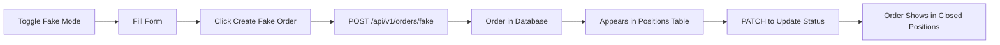

# 🎯 Fake Mode Implementation

The Day-Ahead Trade Ticket form now includes a **Fake Mode** toggle that allows placing orders directly through the website and storing them in the SQLite database, just like the manual `seed_fake_order.py` script.

## 🔧 **Backend Implementation**

### **New Components:**

1. **`fake_order_manager.py`** - Database manager for fake orders
   - Database initialization with proper schema
   - Order creation and management
   - Status updates and approval tracking

2. **New API Endpoints:**
   - `POST /api/v1/orders/fake` - Create fake orders
   - `PATCH /api/v1/orders/fake/{order_id}` - Update order status

### **Database Schema:**
```sql
CREATE TABLE orders (
  id TEXT PRIMARY KEY,
  created_at TEXT NOT NULL,
  market TEXT NOT NULL,              -- 'DA'
  location_type TEXT NOT NULL,       -- 'ZONE'
  location TEXT NOT NULL,            -- 'PJM-RTO'
  hour_start_utc TEXT NOT NULL,      -- ISO8601 UTC
  side TEXT NOT NULL,                -- 'BUY'|'SELL'
  qty_mwh REAL NOT NULL,
  limit_price REAL NOT NULL,
  status TEXT NOT NULL,              -- 'PENDING'|'APPROVED'|'REJECTED'|'CLEARED'|'UNFILLED'
  reject_reason TEXT,
  
  -- Approval columns
  approved_at TEXT,
  approval_rt_interval_start_utc TEXT,
  approval_rt_lmp REAL,
  approval_rt_source TEXT,
  approval_rt_payload TEXT
);
```

## 🎨 **Frontend Implementation**

### **Fake Mode Toggle:**
- **Switch Component**: Easy toggle between Live and Fake modes
- **Visual Indicators**: Orange styling when fake mode is active
- **Different Behavior**: Bypasses market hour restrictions

### **Form Enhancements:**
1. **Fake Mode Active:**
   - Can place orders outside market hours
   - Orders stored directly in SQLite database
   - Shows "Create Fake Order" button
   - Orders get unique UUIDs

2. **Live Mode (Original):**
   - Respects 11:00 AM ET cutoff
   - In-memory simulation only
   - Shows "Submit DA Bid" button

## 🔄 **API Integration**

### **Create Fake Order:**
```bash
POST /api/v1/orders/fake?side=BUY&qty_mwh=5&limit_price=45.00&hour_start_utc=2025-08-17T16:00:00Z&location=PJM-RTO&location_type=ZONE
```

**Response:**
```json
{
  "status": "success",
  "message": "Fake order created successfully",
  "order_id": "3ec7bc61-d604-4648-b2ed-95220cf615b2",
  "order": {
    "id": "3ec7bc61-d604-4648-b2ed-95220cf615b2",
    "created_at": "2025-08-17T08:30:00Z",
    "market": "DA",
    "location_type": "ZONE",
    "location": "PJM-RTO",
    "hour_start_utc": "2025-08-17T16:00:00Z",
    "side": "BUY",
    "qty_mwh": 5,
    "limit_price": 45.0,
    "status": "PENDING"
  }
}
```

### **Update Order Status:**
```bash
PATCH /api/v1/orders/fake/3ec7bc61-d604-4648-b2ed-95220cf615b2?status=APPROVED&approval_rt_lmp=35.97&approval_rt_source=manual
```

## ✅ **Features:**

1. **✅ Fake Mode Toggle**: Switch between fake and live modes
2. **✅ Database Storage**: Orders stored in SQLite just like seed script
3. **✅ Market Hour Bypass**: Can place orders anytime in fake mode
4. **✅ Visual Feedback**: Clear indication when fake mode is active
5. **✅ Order Tracking**: Shows order IDs and status updates
6. **✅ Same Schema**: Compatible with existing fetch_orders API
7. **✅ Status Management**: Can update orders from PENDING to APPROVED

## 🎯 **Usage:**

1. **Enable Fake Mode**: Toggle the switch in the trade ticket form
2. **Place Order**: Fill out form and click "Create Fake Order"
3. **Order Created**: Gets stored in database with PENDING status
4. **View in Positions**: Order appears in `/api/v1/fetch_orders` results
5. **Update Status**: Use PATCH API to approve/reject orders

## 🔄 **Workflow:**



The fake mode completely replicates the `seed_fake_order.py` functionality but through a user-friendly web interface! 🎉

## 🚀 **Benefits:**

- **No more manual scripting**: Place orders directly in UI
- **Same database**: Uses identical schema and storage
- **Real-time feedback**: Immediate confirmation and order IDs
- **Seamless integration**: Works with existing positions table
- **Development friendly**: Easy testing and order creation